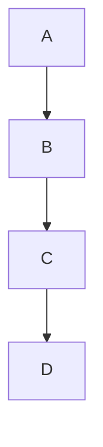
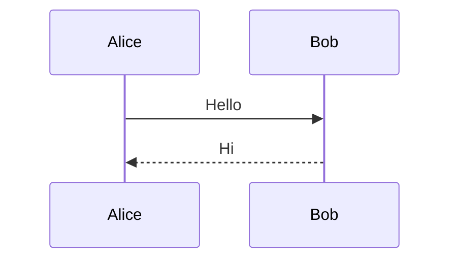
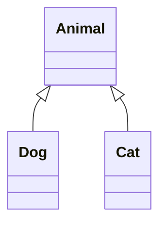
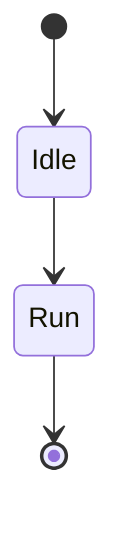

# Mermaid 重载文档

## 图 1



## 图 2



## 图 3



## 图 4



## 图 5


## 图 6


## 图 7


## 图 8


## 图 9


## 图 10


## 图 11


## 图 12


## 图 13


## 图 14


## 图 15


## 图 16


## 图 17


## 图 18


## 图 19


## 图 20


## 图 21

```mermaid
graph TD
    A-->B
    B-->C
    C-->D
```

## 图 22

```mermaid
sequenceDiagram
    Alice->>Bob: Hello
    Bob-->>Alice: Hi
```

## 图 23

```mermaid
classDiagram
    Animal <|-- Dog
    Animal <|-- Cat
```

## 图 24

```mermaid
stateDiagram-v2
    [*] --> Idle
    Idle --> Run
    Run --> [*]
```

## 图 25

```mermaid
graph TD
    A-->B
    B-->C
    C-->D
```

## 图 26

```mermaid
sequenceDiagram
    Alice->>Bob: Hello
    Bob-->>Alice: Hi
```

## 图 27

```mermaid
classDiagram
    Animal <|-- Dog
    Animal <|-- Cat
```

## 图 28

```mermaid
stateDiagram-v2
    [*] --> Idle
    Idle --> Run
    Run --> [*]
```

## 图 29

```mermaid
graph TD
    A-->B
    B-->C
    C-->D
```

## 图 30

```mermaid
sequenceDiagram
    Alice->>Bob: Hello
    Bob-->>Alice: Hi
```

## 图 31

```mermaid
classDiagram
    Animal <|-- Dog
    Animal <|-- Cat
```

## 图 32

```mermaid
stateDiagram-v2
    [*] --> Idle
    Idle --> Run
    Run --> [*]
```

## 图 33

```mermaid
graph TD
    A-->B
    B-->C
    C-->D
```

## 图 34

```mermaid
sequenceDiagram
    Alice->>Bob: Hello
    Bob-->>Alice: Hi
```

## 图 35

```mermaid
classDiagram
    Animal <|-- Dog
    Animal <|-- Cat
```

## 图 36

```mermaid
stateDiagram-v2
    [*] --> Idle
    Idle --> Run
    Run --> [*]
```

## 图 37

```mermaid
graph TD
    A-->B
    B-->C
    C-->D
```

## 图 38

```mermaid
sequenceDiagram
    Alice->>Bob: Hello
    Bob-->>Alice: Hi
```

## 图 39

```mermaid
classDiagram
    Animal <|-- Dog
    Animal <|-- Cat
```

## 图 40

```mermaid
stateDiagram-v2
    [*] --> Idle
    Idle --> Run
    Run --> [*]
```
